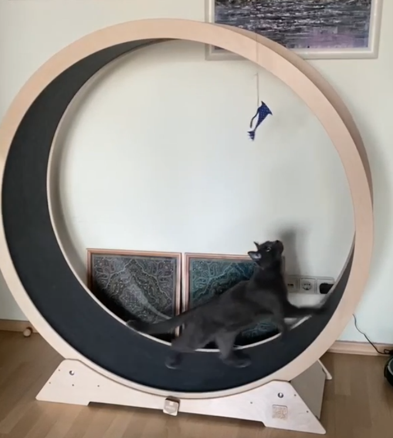
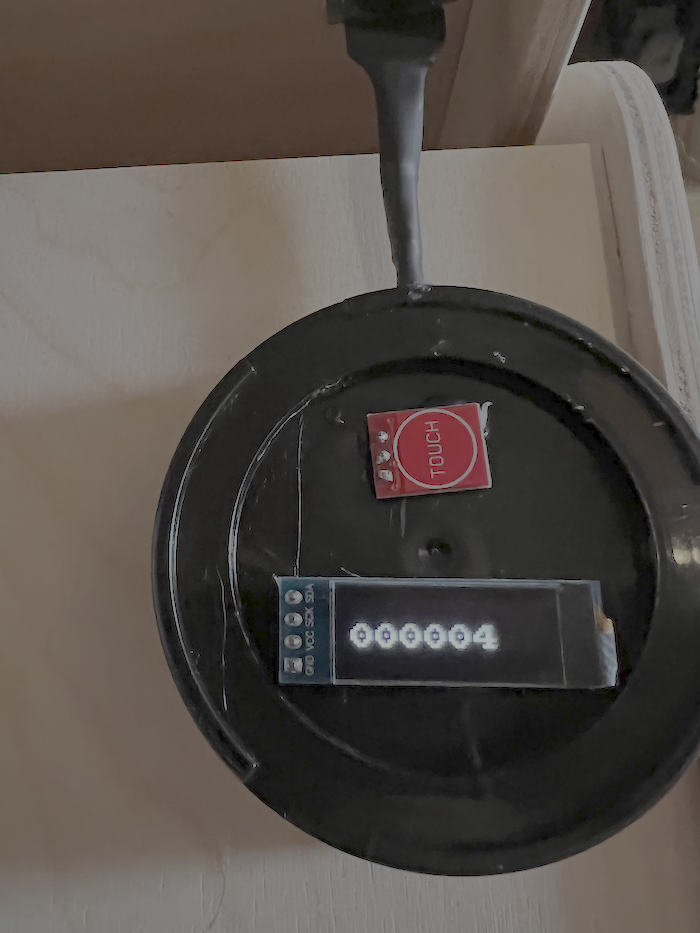

# Cat Wheel Counter

## Electronic project based on CH32V003 RISC-V mC

Simple device intended to calculate count of full circles of rotating (running) wheel for cat named Zoomer.

[Schema (pdf)](docs/Schematic_CatWheel.pdf)

It has connected I2C OLED (128x32) display to show count of full circles. Button to wake up display and clear count numbers with long press.

Magnet on weel and A3295 Hall-effect switch used as main part of project.

Build with [Platformio](https://docs.platformio.org/en/latest/) and [ch32fun](https://github.com/cnlohr/ch32fun) tooling.

Internally it used [CocoOS OS](https://www.cocoos.net/) coroutine library, slightly modified for my needs.

## Finished Cat Wheel Counter

## License

Distributed under the MIT License. See [LICENSE.txt](LICENSE.txt) for more information.